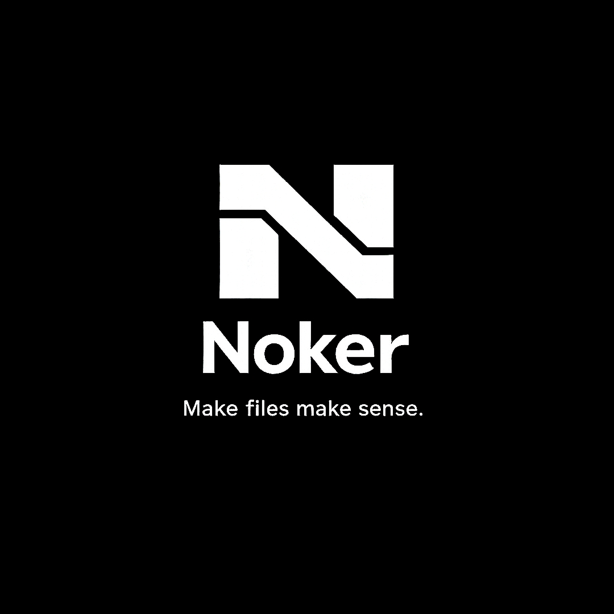

  

  
  
  
  

Noker is a local-first workspace that sits on top of your existing files — without touching them, moving them, or locking them inside a proprietary format.

Your files stay files. Your folders stay folders. Your data stays yours.

Noker adds a layer of structure, meaning, and relationships on top of what's already there. No cloud. No account. No lock-in. Delete Noker tomorrow — your files remain exactly as you left them.

---

## What's Inside

**Explorer** — a direct window into your real file system. Browse, edit, create, rename, delete. No abstractions.

**Editor** — works with text and code. Markdown formatting, two modes (edit and view), search inside a file with Ctrl+F. Every save creates an automatic backup with a timestamp in `nokerbecap` — the original is never lost.

**Workspace** — a project canvas built on top of your files. Pull files from different locations into one unified environment without moving or copying anything. The files stay where they are; Workspace builds context around them.

**OPV (Object Path View)** — the relationship layer at the core of Noker. Type `>note<` anywhere and Noker saves the connection automatically. No menus, no buttons. Relationships exist the moment you write them.

**`[[ ]]` Navigation** — double brackets create document structure and fast jump points. Simple, focused, separate from relationships.

**Graph Foundation** — every OPV connection is stored automatically. The graph grows from real work, not from manual drawing.

**Search** — fast search across all files in your Workspace, by name, content, and OPV connections.

**Export and Sharing** — export as a single file, a ZIP archive, or a `.nkr` package that transfers the full Workspace with all connections and structure intact.

---

## Core Philosophy

- Files belong to you — not to the app
- Nothing is copied, moved, or modified
- No cloud, no server, no account required
- Open-source under MIT license
- One codebase for all platforms — Kotlin Multiplatform

---

## Platforms

Noker is built with Kotlin Multiplatform — one codebase, the same experience on every platform.

| Platform | GUI | Terminal |
|----------|-----|----------|
| macOS | ✓ | ✓ |
| Windows | ✓ | ✓ |
| Android | ✓ | — |

On Android, everything available through the terminal on desktop is handled visually inside the app.

---

## Status

Noker is currently in active development. Alpha 0.1 is being built.

The repository will be updated as development progresses. Follow the project to stay up to date.

---

## Documentation

- [Vision](VISION.md) — why Noker exists and where it's going
- [Alpha 0.1](ALPHA_0.1.md) — what's included in the first release

---

## License

MIT — see [LICENSE](LICENSE) for details.

---

  <i>github.com/kiritough/Noker</i>

